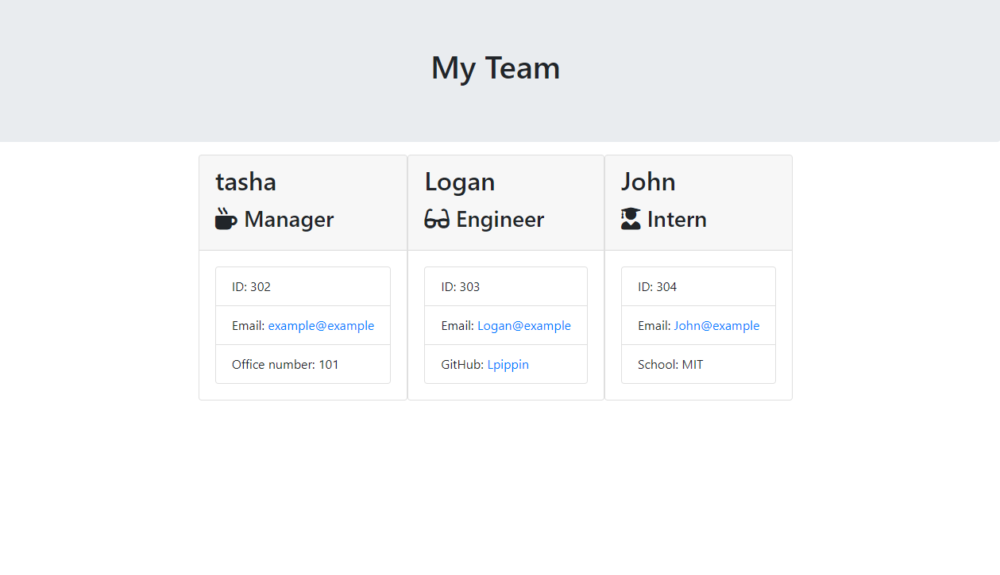

# Team Card Generator

## Table of Contents

- [Description](#Description)
- [Installation](#Installation)
- [Usage](#Usage)
- [License](#License)
- [Contribution](#Contribution)
- [Tests](#Tests)
- [Questions](#Questions)

## Description

It is a console application that allows the user to input information about different members of their work team and then creates a webpage with cards for each of the team members.

## Installation

you need to install inquier and jest

## Usage

you would run node app.js to run the program and then enter all the information that it asks for.

[Demo](https://drive.google.com/file/d/1_4oRZ8d_i02ccov7HyPvcG807gmNNVh4/view)

## License

## Contributing

You don't need to contrubute but if you want to you can email me.

## Tests

run npm run test to run a verbose test

## Questions

- GitHub Username: [LoganPippin](github.com/LoganPippin)
- Email: logan.pippin32@gmail.com
